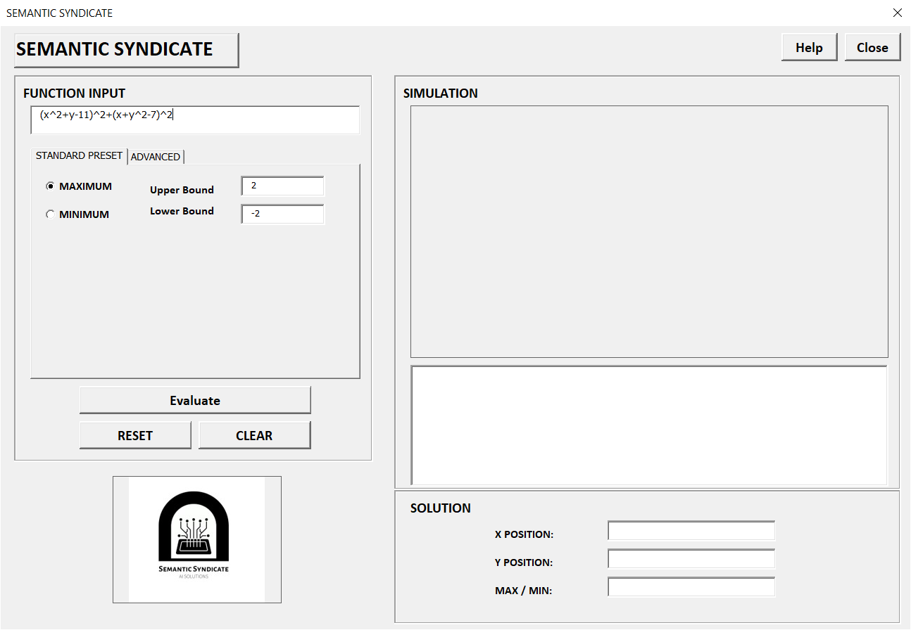
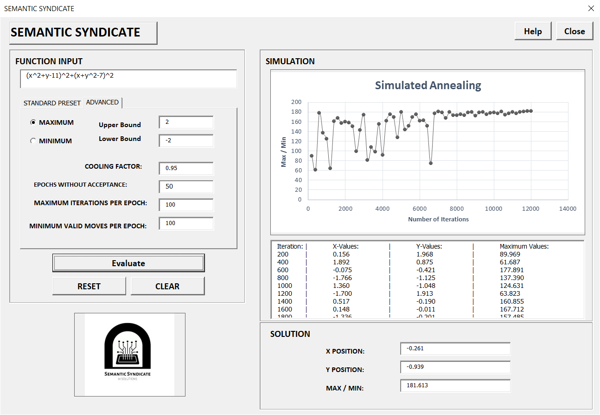
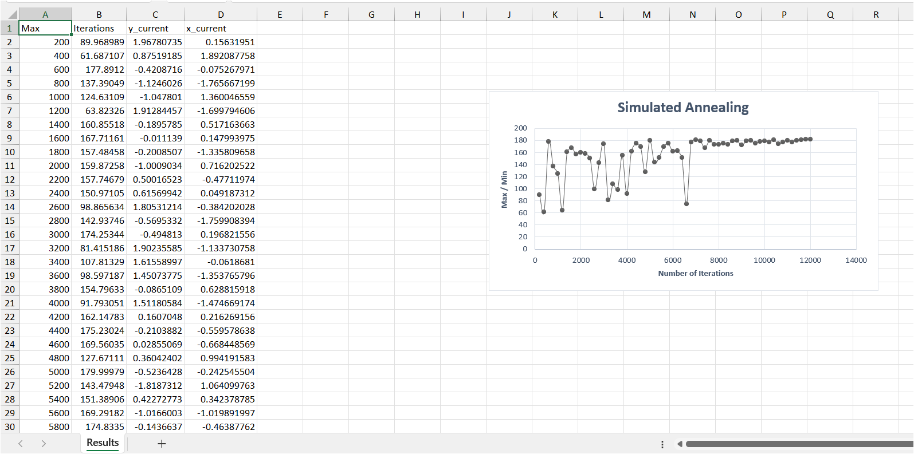

# Simulated Annealing Algorithm — VBA Excel

An Excel VBA implementation of the **Simulated Annealing** metaheuristic optimisation algorithm, built as a 2nd Year Industrial Engineering project at Stellenbosch University (2022).
The Simulated Annealing algorithm finds the global minimum or maximum of user-defined mathematical functions using a cooling-schedule inspired by the annealing process in metallurgy.

## Screenshots

### UserForm — Startup


### UserForm — Results


### Results Sheet



## Features

- **Interactive VBA UserForm** — enter any function with variables `x` and `y`, set relevant bounds, and evaluate the algorithm
- **Standard / Advanced modes** — toggle between simplified input controls and full parameter tuning (cooling rate α, epoch limits, thresholds)
- **Live results table** — iteration-by-iteration output showing convergence toward the optimum point
- **Convergence chart** — graph of the optimisation trajectory is automatically generated and displayed both in the VBA UserForm and on the Results excel sheet
- **Built-in validation** — input handling checks for bounds, alpha range, and empty fields
- **Reset & demo** — Reset button to load Himmelblau's function `(x²+y−11)² + (x+y²−7)²` with default parameters as a test case


## How to Run

1. Download `SimulatedAnnealing.xlsm` from the [Releases](../../releases) page
2. Open .xlsm file in Excel (Windows only) and **Enable Macros** when prompted
3. Press keyboard shortcut `Alt+F11` → double-click `frmOptimiser` in the file tree in the top left options panel → press `F5` to launch
4. Enter a function and set bounds
5. Click **Help** button for function limitation explanation
6. Click **Evaluate** to run algorithm

> **Note:** The UserForm uses Windows-only VBA controls (MSForms) and chart export via GIF. It will not run in Excel for Mac or Excel Online.


## Algorithm Overview

Simulated Annealing is a probabilistic optimisation technique.

Properties of the Simulated Annealing Algorithm:
1. Begins with a random solution within the provided upper and lower bound
2. Generates a neighbouring solution through small random perturbations
3. Always accepts an improvement - will accept worse solutions using a probability which decreases as the "temperature cools"
4. Algorithm will repeat until the temperature is either negligible or no new solutions are discovered

The random perturbations and acceptance of non-improving solutions allow the algorithm to escape local maxima or minima early on (when temperature is high) and converge to the global optimum as it cools. The algorithm is named after the metallurgical process of annealing, where slowly cooling a metal results in a more ordered crystal structure.

## Algorithm Parameters

| Parameter | Default | Description |
|---|---|---|
| Upper / Lower Bound | ±2 | Search space for x and y |
| Alpha (α) | 0.95 | Cooling rate — must be < 1 |
| Max Epochs | 100 | Maximum iterations per temperature step |
| Min Moves | 100 | Minimum accepted moves before cooling |
| Solutions Not Accepted | 50 | Stopping criterion — consecutive epochs with no improvement |


## Project Structure

```
├── README.md
├── LICENSE
├── .gitattributes
├── .gitignore
├── src/
│   ├── frmOptimiser.frm              # UserForm UI and event handlers
│   ├── frmOptimiser.frx              # UserForm binary layout
│   └── modSimulatedAnnealing.bas     # SA algorithm, EvaluateFunction, SAResult Type
└── screenshots/
    ├── frmOptimiser_default.png
    ├── frmOptimiser_results.png
    └── results_sheet.png
```

> **Note:** The `.xlsm` workbook is available as a [GitHub Release](../../releases) rather than tracked in the repo, since binary Excel files don't diff well in version control.


## How to Import the Source Code

If you would prefer to inspect or modify the code without downloading the macro-enabled workbook:

1. Open a blank `.xlsm` workbook in Excel
2. Press the keyboard shortcut `Alt+F11` to open the VBA editor
3. Go to **File → Import File** in the VBA window and select `src/modSimulatedAnnealing.bas`
4. Go to **File → Import File** in the VBA window and select `src/frmOptimiser.frm`
5. The algorithm module and frmOptimiser UserForm will be imported with all of the code


## Authors

Built by **Semantic Syndicate** — a 2nd Year Industrial Engineering project at Stellenbosch University (2022).
- [Alain Rautenbach](https://github.com/Alain-Source)
- [Nico Olivier](https://github.com/Nicof10)

## License

This project is licensed under the [MIT License](LICENSE).